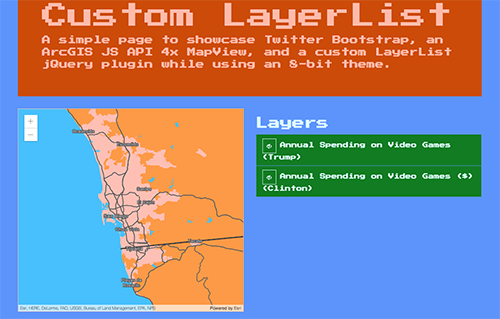
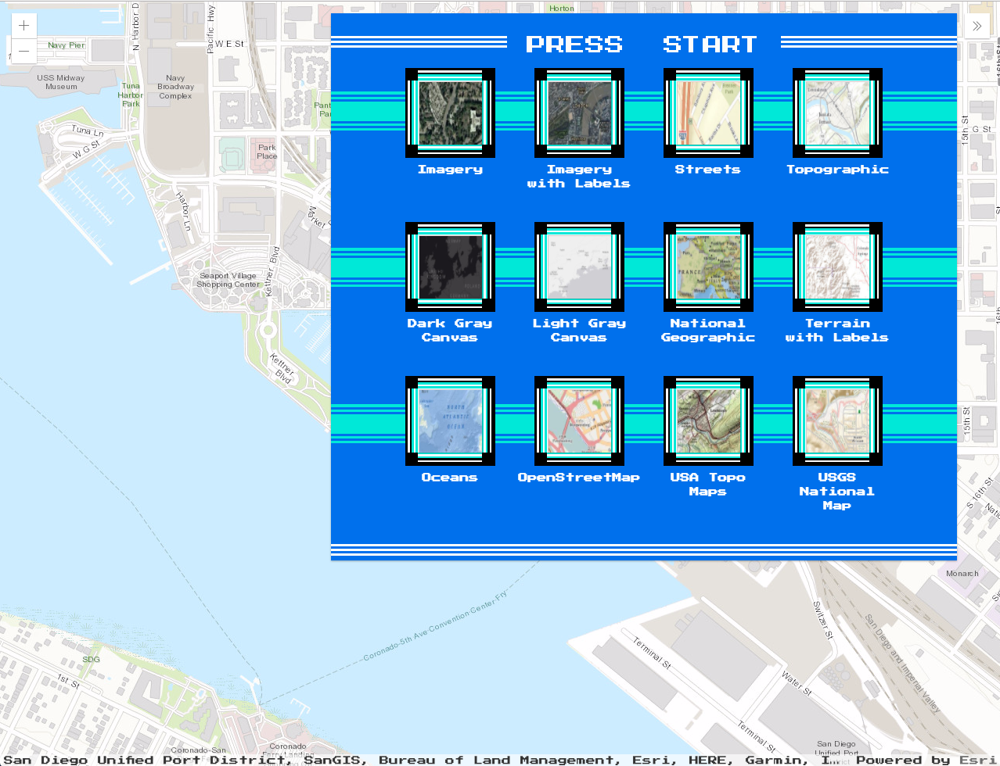

<!-- .slide: data-background="images/start-background.png" -->
<!-- Presenter: Matt -->

# ArcGIS API for JavaScript: Customizing Widgets

### Alan Sangma – [@alansangma](https://twitter.com/alansangma)
### Matt Driscoll – [@driskull](https://twitter.com/driskull)
### JC Franco – [@arfncode](https://twitter.com/arfncode)

---

# Agenda

- Define customizing <!-- .element: class="fragment" data-fragment-index="1" -->
- Approaches <!-- .element: class="fragment" data-fragment-index="2" -->
  - Demos <!-- .element: class="fragment" data-fragment-index="3" -->
- Q & A <!-- .element: class="fragment" data-fragment-index="4" -->
  - Maybe :) <!-- .element: class="fragment" data-fragment-index="5" -->

---

# Customizing Widgets

- Restyling <!-- .element: class="fragment" data-fragment-index="1" -->
  - colors, spacing, font, etc.
- Implementing widget in a different framework <!-- .element: class="fragment" data-fragment-index="2" -->
- Altering presentation of a widget <!-- .element: class="fragment" data-fragment-index="3" -->
- Extending logic of a widget <!-- .element: class="fragment" data-fragment-index="4" -->

---

# Customization Approaches

- Authoring a theme <!-- .element: class="fragment" data-fragment-index="1" -->
- Recreating a view <!-- .element: class="fragment" data-fragment-index="2" -->
- Extending a view <!-- .element: class="fragment" data-fragment-index="3" -->

---


---

<!-- Presenter: Alan -->
<h1 class="eight-bit">Level I</h1>


<h2 class="eight-bit">Theming</h2>

---

# Level I: Theming
## Why Theme?
- Branding                              <!-- .element: class="fragment" data-fragment-index="1" -->
- Match the map                         <!-- .element: class="fragment" data-fragment-index="2" -->
- Contrast with the map                 <!-- .element: class="fragment" data-fragment-index="3" -->
- Based on the environment              <!-- .element: class="fragment" data-fragment-index="4" -->
- User-specific (e.g. bigger buttons)   <!-- .element: class="fragment" data-fragment-index="5" -->

---


#### A powerful scripting language for producing CSS.


---


### Why Sass?
- It's modular.                       <!-- .element: class="fragment" data-fragment-index="1" -->
- It's DRY.                           <!-- .element: class="fragment" data-fragment-index="2" -->
- It makes theming easy.              <!-- .element: class="fragment" data-fragment-index="3" -->

---


### Compiling


---

# Let's Create a Theme!

1. Create your theme directory.
  -   `esri/themes/[your-theme-name]/`
1. Create a Sass file in your directory.
  - `main.scss`
  - `@import "../base/core";`
1. Compile.


```
  <!-- in your app -->
  <link rel="stylesheet" href="esri/themes/[your-theme-name]/main.css">
```

---

Before writing a bunch of CSS selectors, let's look at the
# Theming Method.

---

# Theming Method

Three main areas:
- Color
- Size
- Typography

---

# Theming Method

Three main files:
- `base/_colorVariables.scss`
- `base/_sizes.scss`
- `base/_type.scss`

---

# Theming Method

Default:
```
// Inside base/_colorVariables.scss
$text_color : #6e6e6e !default ;
```

Your theme:
```
// Inside esri/themes/[your-theme-name]/main.scss
$text_color : #0079c1;
```

Any value assignment overrides the `!default` value.

But wait...there's more!

---

# Theming Method

Override the four main color variables...

```
$text_color            : #d1d1d1;
$background_color      : #242424;
$anchor_color          : #9e9e8e;
$button_text_color     : #adadad;
```

_...then magic!_

[Theming Guide](https://developers.arcgis.com/javascript/latest/guide/styling/index.html)

---

# Demo: Theming

<!-- .slide: data-background="images/demo-background.png" -->

---

# Level I: Theming Recap

[TODO: SUMMARIZE]

---

<!-- LEVEL UP A -->
<h1 class="eight-bit">LEVEL UP!</h1>


---

<!-- LEVEL UP B -->
<h1 class="eight-bit">LEVEL II</h1>


<h2 class="eight-bit">Views</h2>

---

<!-- Presenter: JC -->
# JS API v4 Widgets

- View + ViewModel            <!-- .element: class="fragment" data-fragment-index="1" -->
  - Reusable                  <!-- .element: class="fragment" data-fragment-index="2" -->
  - UI replacement            <!-- .element: class="fragment" data-fragment-index="3" -->
  - Framework integration     <!-- .element: class="fragment" data-fragment-index="4" -->

---

<!-- Presenter: Matt -->
# Level II: Views

- Presentation of the Widget              <!-- .element: class="fragment" data-fragment-index="1" -->
- Uses ViewModel APIs to render the UI    <!-- .element: class="fragment" data-fragment-index="2" -->
- View-specific logic resides here        <!-- .element: class="fragment" data-fragment-index="3" -->

---

# Views: Why?

- Separates concerns        <!-- .element: class="fragment" data-fragment-index="1" -->
- Framework compatibility   <!-- .element: class="fragment" data-fragment-index="2" -->

---

# Level II: Working with Views

Example: [LayerList](https://developers.arcgis.com/javascript/latest/api-reference/esri-widgets-LayerList.html) widget

- [LayerList.tsx](https://github.com/Esri/arcgis-js-api/blob/4master/widgets/LayerList.tsx) (View)
- [LayerList.scss](https://github.com/Esri/arcgis-js-api/blob/4master/themes/base/widgets/_LayerList.scss) (Theme)

---

# Views: Let's customize!

Lets create a custom widget view. <!-- .element: class="fragment" data-fragment-index="1" -->

Using <!-- .element: class="fragment" data-fragment-index="2" -->

- jQuery <!-- .element: class="fragment" data-fragment-index="3" -->
- Bootstrap <!-- .element: class="fragment" data-fragment-index="3" -->

---

# Demo

Create a custom LayerList view for a Bootstrap app

[Demo Steps](https://github.com/jcfranco/uc-2017-customizing-widgets/blob/master/demos/steps.md)



<!-- .slide: data-background="images/demo-background.png" -->

---

# Level II: Views Recap

What have we learned? <!-- .element: class="fragment" data-fragment-index="1" -->

- View <!-- .element: class="fragment" data-fragment-index="2" -->
  - Face of the widget <!-- .element: class="fragment" data-fragment-index="3" -->
  - Renders the viewModel brains <!-- .element: class="fragment" data-fragment-index="4" -->
  - Separation allows easy framework integration <!-- .element: class="fragment" data-fragment-index="5" -->
- Demo <!-- .element: class="fragment" data-fragment-index="6" -->
  - Where to get widget info in the API <!-- .element: class="fragment" data-fragment-index="7" -->
  - How to create a custom view in another framework <!-- .element: class="fragment" data-fragment-index="8" -->

---

<!-- LEVEL UP A -->
<h1 class="eight-bit">LEVEL UP!</h1>


---

<!-- LEVEL UP B -->
<h1 class="eight-bit">LEVEL III</h1>


<h2 class="eight-bit">Extending a View</h2>

---

<!-- Presenter: JC -->
# Level III: Extending a View

- Why?                          <!-- .element: class="fragment" data-fragment-index="1" -->
  - Reusable                    <!-- .element: class="fragment" data-fragment-index="2" -->
  - Same ecosystem              <!-- .element: class="fragment" data-fragment-index="3" -->
- How?                          <!-- .element: class="fragment" data-fragment-index="4" -->
  - JS API v4.4                 <!-- .element: class="fragment" data-fragment-index="5" -->
  - TypeScript                  <!-- .element: class="fragment" data-fragment-index="6" -->
  - esri/widgets/Widget         <!-- .element: class="fragment" data-fragment-index="7" -->
- Where?                        <!-- .element: class="fragment" data-fragment-index="8" -->
  - Right here, right now :)    <!-- .element: class="fragment" data-fragment-index="9" -->

---

`esri/widgets/Widget`

- Provides lifecycle            <!-- .element: class="fragment" data-fragment-index="1" -->
- API consistency               <!-- .element: class="fragment" data-fragment-index="2" -->
- Built with TypeScript         <!-- .element: class="fragment" data-fragment-index="3" -->

---

# Lifecycle

- constructor         <!-- .element: class="fragment" data-fragment-index="1" -->
- postInitialize      <!-- .element: class="fragment" data-fragment-index="2" -->
- render              <!-- .element: class="fragment" data-fragment-index="3" -->
- destroy             <!-- .element: class="fragment" data-fragment-index="8" -->

---

# `render`

- Defines UI                <!-- .element: class="fragment" data-fragment-index="1" -->
- Reacts to state           <!-- .element: class="fragment" data-fragment-index="2" -->
- Uses JSX                  <!-- .element: class="fragment" data-fragment-index="3" -->

```js
render() {
  const x = Number(x).toFixed(3);
  const y = Number(y).toFixed(3);
  const scale = Number(scale).toFixed(5);

  return (
    <div bind={this} class={CSS.base} onclick={this._handleClick}>
      <p>x: {x}</p>
      <p>y: {y}</p>
      <p>scale: {scale}</p>
    </div>
  );
}
```
<!-- .element: class="fragment current-visible" data-fragment-index="4" -->

---

# TypeScript

- Typed JavaScript <!-- .element: class="fragment" data-fragment-index="1" -->

```ts
let view: MapView | SceneView;

// later...

// TS2322: Type '"not-a-view"' is not assignable
// to type 'MapView | SceneView'.
view = "not-a-view";
```
<!-- .element: class="fragment" data-fragment-index="2" -->

---

# TypeScript

- JS of the future, now

```ts
// const
const numbers = [1, 2, 3];

// fat arrow functions
letters.forEach(letter => console.log(letter));

// template literals
const myString = `last number: ${ numbers[ numbers.length - 1 ] }`;

// decorators
class Example {
  @log
  stringify(item: object): string { /* ... */ }
}
```
<!-- .element: class="fragment" data-fragment-index="1" -->

---

# TypeScript

- IDE support
  - Visual Studio   <!-- .element: class="fragment" data-fragment-index="1" -->
  - WebStorm        <!-- .element: class="fragment" data-fragment-index="1" -->
  - Sublime         <!-- .element: class="fragment" data-fragment-index="1" -->
  - and more!       <!-- .element: class="fragment" data-fragment-index="1" -->

---

# Demo: Extending a View



<!-- .slide: data-background="images/demo-background.png" -->

---

# Level III: Extending a View Recap

- Reusable                      <!-- .element: class="fragment" data-fragment-index="1" -->
  - View/ViewModel                  <!-- .element: class="fragment" data-fragment-index="2" -->
- Same ecosystem                <!-- .element: class="fragment" data-fragment-index="3" -->
  - No extra libraries              <!-- .element: class="fragment" data-fragment-index="4" -->
- Extended esri/widgets/Widget      <!-- .element: class="fragment" data-fragment-index="5" -->
  - JS API v4.4                   <!-- .element: class="fragment" data-fragment-index="6" -->
  - TypeScript                  <!-- .element: class="fragment" data-fragment-index="7" -->

---

<!-- LEVEL UP A -->
<h1 class="eight-bit">LEVEL UP!</h1>


---

<!-- LEVEL UP B -->
<h1 class="eight-bit">LEVEL IV</h1>


<p class="eight-bit">Put it all together.</p>

---

# Conclusion

- Authored a theme      <!-- .element: class="fragment" data-fragment-index="1" -->
- Recreated a view      <!-- .element: class="fragment" data-fragment-index="2" -->
- Extended a view       <!-- .element: class="fragment" data-fragment-index="3" -->

---

## Suggested Session

- [Developing Your Own Widget with the ArcGIS API for JavaScript
](https://userconference2017.schedule.esri.com/schedule/603662896)

---

## Additional Resources

- [Implementing Accessor](https://developers.arcgis.com/javascript/latest/guide/implementing-accessor/index.html)
- [Setting up TypeScript](https://developers.arcgis.com/javascript/latest/guide/typescript-setup/index.html)
- [Widget Development](https://developers.arcgis.com/javascript/latest/guide/custom-widget/index.html)
- [JS API SDK](https://developers.arcgis.com/javascript/)

---

# The source code!

## [esriurl.com/customwidgets-uc2017](http://esriurl.com/customwidgets-uc2017)

---

<!-- .slide: data-background="images/survey-background.png" -->

---

# Questions?


---


---

<!-- .slide: data-background="images/end-background.png" -->
